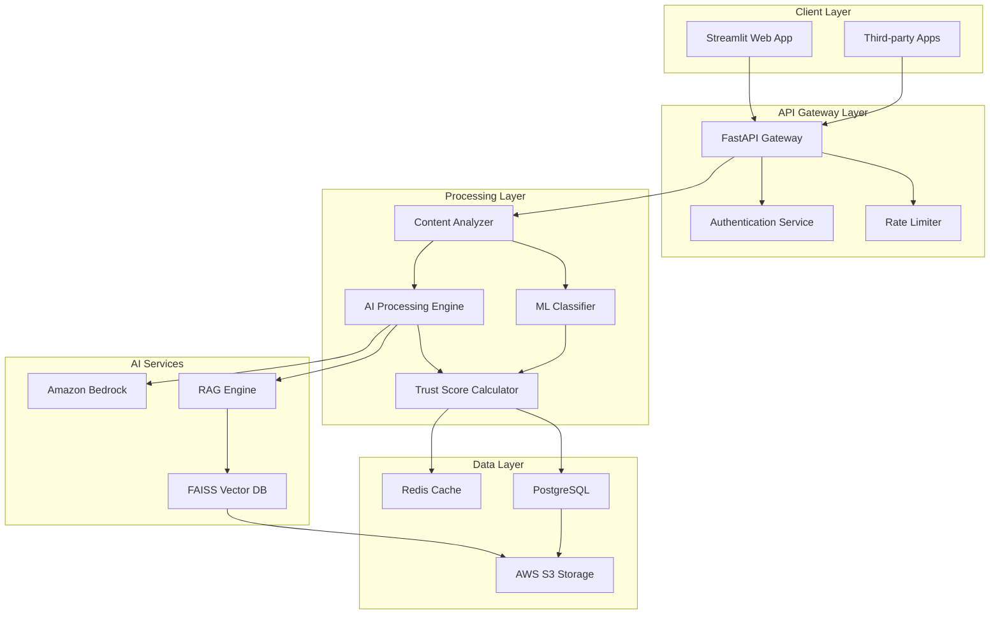
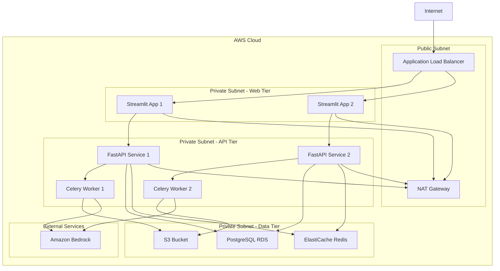

# Design Document

## Overview

TrustGuard AI is a comprehensive scam detection system built on AWS infrastructure, leveraging Amazon Bedrock for AI capabilities, FastAPI for backend services, and Streamlit for the web interface. The system employs a multi-layered approach combining large language models, retrieval-augmented generation (RAG), and machine learning classifiers to provide accurate scam detection with trust scores and evidence-based explanations.

The architecture follows a microservices pattern with clear separation between the web interface, API gateway, AI processing engines, and data storage layers. This design ensures scalability, maintainability, and the ability to serve both direct users and third-party integrations.

## Architecture

### High-Level Architecture



### Component Architecture

The system is organized into distinct layers with clear responsibilities:

**Presentation Layer**: Streamlit web application providing user interface for content submission, result visualization, and dashboard analytics.

**API Layer**: FastAPI-based gateway handling authentication, rate limiting, request routing, and response formatting for both web and API clients.

**Business Logic Layer**: Core processing components including content analysis, AI processing coordination, and trust score calculation.

**AI Services Layer**: Integration with Amazon Bedrock for natural language processing and custom RAG engine for trusted source verification.

**Data Layer**: Multi-tier storage including Redis for caching, PostgreSQL for structured data, FAISS for vector search, and S3 for file storage.

## Components and Interfaces

### Content Analyzer

**Purpose**: Orchestrates the analysis pipeline for submitted content, coordinating between AI services and ML classifiers.

**Key Methods**:
- `analyze_content(content: str, content_type: ContentType) -> AnalysisResult`
- `extract_urls(content: str) -> List[str]`
- `fetch_url_content(url: str) -> str`
- `detect_language(content: str) -> Language`

**Interfaces**:
- Input: Raw content (text, URLs, structured data)
- Output: Structured analysis results with confidence scores
- Dependencies: AI Processing Engine, ML Classifier, URL fetcher

### AI Processing Engine

**Purpose**: Manages interactions with Amazon Bedrock and coordinates RAG-based verification against trusted sources.

**Key Methods**:
- `process_with_bedrock(content: str, language: Language) -> BedrockResult`
- `verify_with_rag(content: str, context: str) -> RAGResult`
- `generate_explanation(analysis: AnalysisResult, language: Language) -> str`

**Interfaces**:
- Input: Preprocessed content with metadata
- Output: AI analysis results with confidence and reasoning
- Dependencies: Amazon Bedrock API, RAG Engine, Vector Database

### ML Classifier

**Purpose**: Applies trained machine learning models to detect known scam patterns and techniques.

**Key Methods**:
- `classify_scam_patterns(features: FeatureVector) -> ClassificationResult`
- `extract_features(content: str) -> FeatureVector`
- `update_model(training_data: List[TrainingExample]) -> None`

**Interfaces**:
- Input: Feature vectors extracted from content
- Output: Classification probabilities and detected patterns
- Dependencies: Pre-trained models, feature extraction pipeline

### RAG Engine

**Purpose**: Retrieves relevant information from trusted Indian sources to provide context for verification.

**Key Methods**:
- `retrieve_context(query: str, top_k: int = 5) -> List[Document]`
- `update_knowledge_base(sources: List[TrustedSource]) -> None`
- `semantic_search(embedding: Vector) -> List[ScoredDocument]`

**Interfaces**:
- Input: Search queries and content embeddings
- Output: Ranked relevant documents from trusted sources
- Dependencies: FAISS Vector Database, embedding models

### Trust Score Calculator

**Purpose**: Combines results from multiple analysis engines to generate final trust scores and risk levels.

**Key Methods**:
- `calculate_trust_score(ai_result: BedrockResult, ml_result: ClassificationResult, rag_result: RAGResult) -> TrustScore`
- `determine_risk_level(trust_score: float) -> RiskLevel`
- `generate_evidence_report(analysis_results: AnalysisResults, language: Language) -> EvidenceReport`

**Interfaces**:
- Input: Combined analysis results from all engines
- Output: Trust score (0-100), risk level, and evidence report
- Dependencies: Scoring algorithms, explanation generators

### User Dashboard Service

**Purpose**: Provides analytics, history tracking, and educational content for users.

**Key Methods**:
- `get_user_history(user_id: str, filters: HistoryFilters) -> List[AnalysisRecord]`
- `generate_analytics(user_id: str, time_range: TimeRange) -> UserAnalytics`
- `get_educational_content(user_profile: UserProfile) -> List[EducationalTip]`

**Interfaces**:
- Input: User identification and filter parameters
- Output: Historical data, analytics, and personalized content
- Dependencies: PostgreSQL database, user profiling service

## Data Models

### Core Data Structures

```python
@dataclass
class ContentSubmission:
    content: str
    content_type: ContentType  # TEXT, URL, JOB_OFFER, ADVERTISEMENT
    language: Language  # ENGLISH, HINDI, MIXED
    user_id: Optional[str]
    timestamp: datetime
    metadata: Dict[str, Any]

@dataclass
class AnalysisResult:
    trust_score: float  # 0.0 to 100.0
    risk_level: RiskLevel  # SAFE, SUSPICIOUS, DANGEROUS
    confidence: float  # 0.0 to 1.0
    evidence_report: EvidenceReport
    processing_time: float
    analysis_id: str

@dataclass
class EvidenceReport:
    summary: str
    risk_factors: List[RiskFactor]
    trusted_sources: List[SourceReference]
    recommendations: List[str]
    language: Language

@dataclass
class RiskFactor:
    factor_type: str  # "suspicious_url", "fake_job_offer", "phishing_attempt"
    severity: Severity  # LOW, MEDIUM, HIGH, CRITICAL
    description: str
    confidence: float

@dataclass
class TrustedSource:
    source_id: str
    name: str
    url: str
    source_type: SourceType  # GOVERNMENT, NEWS, EDUCATIONAL, VERIFIED_ORGANIZATION
    credibility_score: float
    last_updated: datetime
    content_hash: str
```

### Database Schema

**Users Table**:
- user_id (UUID, Primary Key)
- email (String, Unique)
- preferred_language (Enum)
- created_at (Timestamp)
- last_active (Timestamp)

**Analysis_Records Table**:
- analysis_id (UUID, Primary Key)
- user_id (UUID, Foreign Key)
- content_hash (String)
- trust_score (Float)
- risk_level (Enum)
- evidence_report (JSONB)
- created_at (Timestamp)
- processing_time (Float)

**Trusted_Sources Table**:
- source_id (UUID, Primary Key)
- name (String)
- url (String)
- source_type (Enum)
- credibility_score (Float)
- content_embedding (Vector)
- last_updated (Timestamp)

**API_Keys Table**:
- key_id (UUID, Primary Key)
- api_key_hash (String)
- organization (String)
- rate_limit (Integer)
- created_at (Timestamp)
- expires_at (Timestamp)

## Error Handling

### Error Classification

**Input Validation Errors**:
- Invalid content format or encoding
- Unsupported language detection
- Malformed URLs or inaccessible content
- Content size exceeding limits

**Processing Errors**:
- Amazon Bedrock API failures or timeouts
- Vector database connection issues
- ML model inference failures
- RAG retrieval timeouts

**System Errors**:
- Database connection failures
- Cache service unavailability
- External service dependencies down
- Resource exhaustion (memory, CPU)

### Error Handling Strategy

**Graceful Degradation**:
When AI services are unavailable, the system falls back to ML classifier results with reduced confidence scores. When both AI and ML services fail, the system returns cached results for similar content with appropriate warnings.

**Retry Logic**:
Transient failures trigger exponential backoff retry mechanisms with circuit breakers to prevent cascade failures. Critical path operations have timeout limits to ensure responsive user experience.

**Error Response Format**:
```python
@dataclass
class ErrorResponse:
    error_code: str
    message: str
    details: Optional[Dict[str, Any]]
    retry_after: Optional[int]
    fallback_result: Optional[AnalysisResult]
```

**Monitoring and Alerting**:
All errors are logged with structured metadata for analysis. Critical errors trigger immediate alerts to the operations team. Error rates and patterns are monitored for proactive system health management.

## Testing Strategy

### Dual Testing Approach

The testing strategy employs both unit testing and property-based testing to ensure comprehensive coverage and correctness validation.

**Unit Testing Focus**:
- Specific examples demonstrating correct behavior for known scam patterns
- Integration points between AI services and data layers
- Edge cases like malformed URLs, mixed-language content, and API rate limiting
- Error conditions and fallback mechanisms

**Property-Based Testing Focus**:
- Universal properties that must hold across all content types and languages
- Comprehensive input coverage through randomized test generation
- Validation of trust score consistency and evidence report completeness
- Performance characteristics under varying load conditions

**Testing Configuration**:
- Property tests configured for minimum 100 iterations using Hypothesis (Python)
- Each property test references its corresponding design document property
- Test tags follow format: **Feature: trustguard-ai, Property {number}: {property_text}**
- Continuous integration pipeline runs both unit and property tests on every commit

### Integration Testing

**API Integration Tests**:
- End-to-end workflows from content submission to result delivery
- Authentication and authorization mechanisms
- Rate limiting and quota enforcement
- Multi-language content processing pipelines

**AI Service Integration Tests**:
- Amazon Bedrock API integration with various content types
- RAG engine retrieval accuracy with trusted source database
- ML classifier performance with known scam datasets
- Trust score calculation consistency across analysis engines

**Performance Testing**:
- Load testing with concurrent users and API requests
- Stress testing of AI service integration under high volume
- Memory and CPU usage profiling during peak operations
- Database query performance optimization validation

## Correctness Properties

*A property is a characteristic or behavior that should hold true across all valid executions of a system—essentially, a formal statement about what the system should do. Properties serve as the bridge between human-readable specifications and machine-verifiable correctness guarantees.*

Based on the requirements analysis, the following correctness properties ensure the system behaves correctly across all inputs and scenarios:

### Property 1: Universal Trust Score Generation
*For any* submitted content (text, URL, job offer, or advertisement), the system should always return a trust score between 0 and 100 inclusive.
**Validates: Requirements 1.1, 1.2, 1.3, 3.1**

### Property 2: Evidence Report Completeness
*For any* analyzed content, the system should generate a complete evidence report containing specific indicators, risk factors, and recommendations.
**Validates: Requirements 1.4, 4.1**

### Property 3: Risk Level Consistency
*For any* trust score, the assigned risk level should be consistent with the defined mapping: 0-30 = Dangerous, 31-70 = Suspicious, 71-100 = Safe.
**Validates: Requirements 1.5, 3.2, 3.3, 3.4**

### Property 4: Multi-Language Processing
*For any* content submitted in English, Hindi, or mixed languages, the system should successfully process and analyze it, returning results in the same language as the input.
**Validates: Requirements 2.5, 5.1, 5.2, 5.3, 5.4**

### Property 5: RAG Engine Retrieval
*For any* content requiring verification, the RAG engine should attempt to retrieve relevant information from the trusted source database.
**Validates: Requirements 2.2**

### Property 6: ML Classification Execution
*For any* submitted content, the ML classifier should execute pattern detection and return classification results.
**Validates: Requirements 2.3**

### Property 7: Result Presentation Completeness
*For any* analysis result, the system should present both numerical trust scores and categorical risk levels.
**Validates: Requirements 3.5**

### Property 8: Suspicious Content Red Flag Listing
*For any* content flagged as suspicious (trust score 31-70), the evidence report should contain a non-empty list of specific red flags detected.
**Validates: Requirements 4.2**

### Property 9: Source Citation Accuracy
*For any* evidence report that references trusted sources, all cited sources should be properly attributed with source names and types.
**Validates: Requirements 4.3**

### Property 10: Risk Factor Severity Ordering
*For any* evidence report containing multiple risk factors, the risk factors should be ordered by severity (Critical > High > Medium > Low).
**Validates: Requirements 4.5**

### Property 11: Dashboard History Access
*For any* authenticated user accessing their dashboard, the system should display their verification history with all required fields (content, trust score, timestamp).
**Validates: Requirements 6.1, 6.4**

### Property 12: Analytics Completeness
*For any* user analytics request, the dashboard should return statistics including content types analyzed and risk levels encountered.
**Validates: Requirements 6.2**

### Property 13: Dashboard Filtering Functionality
*For any* history browsing request, the dashboard should support filtering by date, risk level, and content type.
**Validates: Requirements 6.3**

### Property 14: API Authentication Enforcement
*For any* API request without valid authentication, the system should reject the request and return an authentication error.
**Validates: Requirements 7.1**

### Property 15: API Response Structure Consistency
*For any* valid API request, the response should be structured JSON containing trust score, risk level, and evidence report in machine-readable format.
**Validates: Requirements 7.2, 7.4**

### Property 16: Rate Limiting Enforcement
*For any* API client exceeding usage limits, the system should enforce rate limiting and return appropriate error messages with retry information.
**Validates: Requirements 7.3**

### Property 17: Performance Bounds
*For any* text content analysis, the system should return results within 5 seconds, and for URL analysis within 10 seconds.
**Validates: Requirements 8.1, 8.2**

### Property 18: Request Queuing Under Load
*For any* system experiencing high load, requests should be queued with estimated wait times provided to users.
**Validates: Requirements 8.4**

### Property 19: Graceful Service Degradation
*For any* service failure scenario, the system should provide graceful degradation using cached results where available, with appropriate warnings.
**Validates: Requirements 8.5**

### Property 20: PII Protection
*For any* content processing operation, personally identifiable information should not be stored without explicit user consent.
**Validates: Requirements 9.3**

### Property 21: Data Deletion Compliance
*For any* user data deletion request, the system should successfully remove the user's data and confirm deletion.
**Validates: Requirements 9.4**

### Property 22: Source Indexing Completeness
*For any* new trusted source added to the system, the vector database should successfully index its content and make it searchable.
**Validates: Requirements 10.1**

### Property 23: Source Query Relevance
*For any* query to the vector database, the returned results should be ranked by relevance and include the most recent information available.
**Validates: Requirements 10.3**

### Property 24: Source Prioritization
*For any* conflicting information from multiple sources, government and official sources should be prioritized over news sources in the final assessment.
**Validates: Requirements 10.4**

## Technology Stack

### Backend Services
- **FastAPI**: RESTful API framework for high-performance backend services
- **Python 3.11+**: Primary programming language for backend development
- **Pydantic**: Data validation and serialization using Python type annotations
- **SQLAlchemy**: ORM for database operations and migrations
- **Alembic**: Database migration management
- **Celery**: Distributed task queue for background processing
- **Redis**: Caching layer and Celery message broker

### AI and Machine Learning
- **Amazon Bedrock**: Large language model integration for natural language understanding
- **FAISS**: Vector database for semantic search and similarity matching
- **Sentence Transformers**: Text embedding generation for RAG system
- **scikit-learn**: Machine learning classifiers for scam pattern detection
- **spaCy**: Natural language processing for text preprocessing
- **langdetect**: Language detection for multi-language support

### Frontend and User Interface
- **Streamlit**: Web application framework for rapid UI development
- **Plotly**: Interactive data visualization for analytics dashboard
- **Streamlit-Authenticator**: User authentication and session management
- **Pandas**: Data manipulation for analytics and reporting

### Data Storage and Infrastructure
- **PostgreSQL**: Primary relational database for structured data
- **AWS S3**: Object storage for files, models, and backups
- **Docker**: Containerization for consistent deployment environments
- **AWS ECS**: Container orchestration and scaling
- **AWS Application Load Balancer**: Traffic distribution and SSL termination
- **AWS CloudWatch**: Monitoring, logging, and alerting

### Development and Deployment
- **Poetry**: Python dependency management and packaging
- **pytest**: Unit testing framework with property-based testing support
- **Hypothesis**: Property-based testing library for comprehensive test coverage
- **Black**: Code formatting and style consistency
- **mypy**: Static type checking for Python code
- **GitHub Actions**: CI/CD pipeline automation
- **Terraform**: Infrastructure as Code for AWS resource management

## Deployment Architecture

### Production Environment



### Scalability Considerations

**Horizontal Scaling**: The architecture supports horizontal scaling through container orchestration with AWS ECS. Both web and API tiers can scale independently based on demand.

**Database Scaling**: PostgreSQL RDS supports read replicas for read-heavy workloads. The vector database (FAISS) can be partitioned across multiple instances for large-scale deployments.

**Caching Strategy**: Multi-tier caching with Redis for frequently accessed results and CloudFront CDN for static assets reduces database load and improves response times.

**Background Processing**: Celery workers handle computationally intensive AI processing asynchronously, preventing API timeouts and improving user experience.

## Security Considerations

### Authentication and Authorization
- JWT-based API authentication with configurable expiration
- Role-based access control for administrative functions
- API key management with rate limiting and usage tracking
- Multi-factor authentication support for sensitive operations

### Data Protection
- End-to-end encryption for data in transit using TLS 1.3
- AES-256 encryption for sensitive data at rest
- Database connection encryption and credential rotation
- Secure secret management using AWS Secrets Manager

### Input Validation and Sanitization
- Comprehensive input validation using Pydantic models
- SQL injection prevention through parameterized queries
- XSS protection through content sanitization
- File upload restrictions and malware scanning

### Privacy and Compliance
- GDPR and Indian data protection law compliance
- Data anonymization for analytics and model training
- Audit logging for all data access and modifications
- Right to deletion implementation with complete data removal

### Infrastructure Security
- VPC isolation with private subnets for sensitive components
- Security groups with least-privilege access rules
- WAF protection against common web attacks
- Regular security scanning and vulnerability assessments

## Monitoring and Observability

### Application Monitoring
- Real-time performance metrics for API response times
- AI service integration health and error rates
- Database query performance and connection pooling
- Cache hit rates and memory usage optimization

### Business Metrics
- Trust score distribution and accuracy tracking
- User engagement and feature adoption rates
- Scam detection effectiveness and false positive rates
- API usage patterns and client behavior analysis

### Alerting and Incident Response
- Automated alerts for system failures and performance degradation
- Escalation procedures for critical security incidents
- Health checks and automated recovery mechanisms
- Comprehensive logging for debugging and forensic analysis

This design provides a robust, scalable, and secure foundation for TrustGuard AI while maintaining flexibility for future enhancements and integrations.